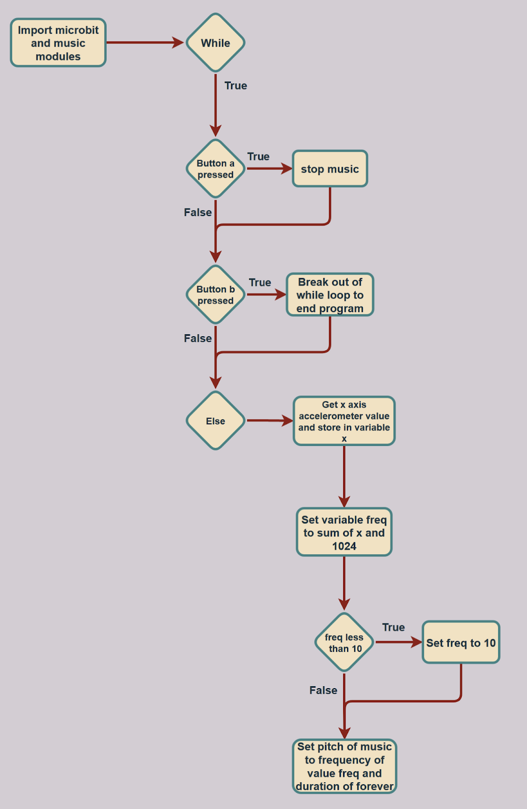

# Microbit_Lesson_16
Lesson 16 of my Intro to Python class with the Microbit.

Program Overview: This program is a tilt-adjusted music player. It constantly plays one note and adjusts the note’s pitch based on the tilt of the microbit. It uses the built-in accelerometer to sense tilt levels and also takes inputs with the two microbit buttons. Clicking button a will stop the music and clicking button b will end the program.

New Learnings: One new learning in this lesson is the music.pitch() function. It changes the pitch of the music with a given frequency and can also take in a duration parameter to control the duration of the music. In the context of this program, this function is what performs the pitch change once a tilt is detected from the microbit.

Real-World Connections: One real-world connection made with this program is musical instruments. All musical instruments have some sort of input they take in and they produce an output in the form of a note. The same thing is happening with this program except it’s on a simpler scale. Using the y axis from the accelerometer another layer of complexity could be added to this program and it could be made into a much more complex instrument.

Applications: One application for this program would be to create an instrument tuner. The tuner would work similarly to this program but it would play more accurate notes to help tune instruments such as violins. It could play a specific note through the attached speaker, like the E note and the violinist could tune their E string to match the sound being played by the microbit. Since the microbit is a computer it will always perfectly recreate the note and this makes for a highly reliable tuner. The size of the microbit also means that it’s portable which makes for an easy traveling experience for the user. The screen could be used to display the note being played and the buttons would be the inputs to change the note.

